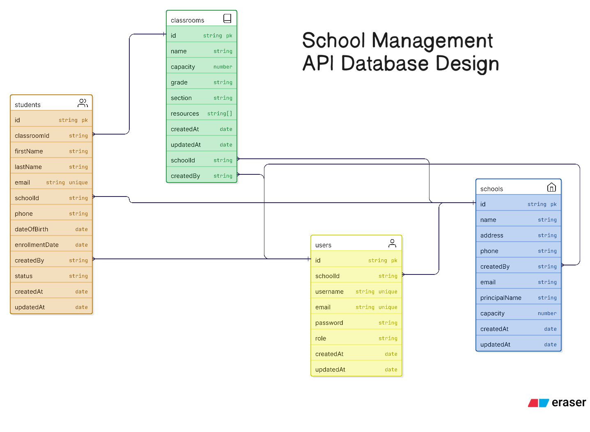

# School Management System API: Technical Challenge

This documentation outlines the implementation of a robust **School Management System API** built upon the **Axion** architectural framework. This project serves as a technical demonstration of system design, role-based access control (RBAC), and scalable backend architecture using Node.js, MongoDB, and Redis.

---

## 🏛 System Architecture

The project adheres to the **Axion** boilerplate structure, emphasizing a clear separation of concerns through specialized layers:

* **Managers**: The brain of the application where business logic and entity orchestration reside.
* **Loaders**: Responsible for bootstrapping the system, including database connections and service initialization.
* **Cortex**: A Redis-powered communication layer for high-performance data handling.
* **Connect**: Dedicated logic for MongoDB persistence and schema management.

---

## 🚀 Getting Started

### Prerequisites

* **Node.js**: v14+ (v18+ recommended for stability).
* **Database**: A running MongoDB instance (Local or Docker).
* **Cache**: A standard TCP Redis connection (e.g., [Upstash](https://upstash.com)).

### 1. Initialization

Clone the repository and install the core dependencies:

```bash
git clone https://github.com/AhsanRiaz9/axion
cd axion
npm install

```

### 2. Environment Configuration

Create a `.env` file from the provided template:

```bash
cp .env.example .env

```
And change .env values according to your services.
---

## 🛠 Core Functionalities

### 1. School Management (Superadmin)

The system provides a dedicated administrative layer for high-level management:

* **Provisioning**: Create and initialize new school entries.
* **Profile Control**: Full CRUD operations for school metadata.
* **Isolation**: Ensure data integrity across different school entities.

### 2. Role-Based Access Control (RBAC)

Security is implemented through a granular permission system:

* **Superadmin**: Global system access and school management.
* **School Admin**: Management of teachers, students, and school-specific settings.

---

## 🖥 Execution Guide

### Development Environment

To run the server with hot-reloading (via `nodemon`):

```bash
npm run dev

```

### Production Environment

To build and execute for high-performance environments:

```bash
npm start

```

*The default service port is **5111**.*

## 🧪 Quality Assurance

Maintain system integrity by running the automated test suite:

```bash
npm test

```

# 🚀 Deploying to Railway

Follow these steps to deploy your application from GitHub to [Railway](https://railway.app/).

### 1. Initial Setup

* Navigate to **Railway** and log in (or sign up using GitHub).
* Click the **New Project** button in the top right corner.
* Select **Deploy from GitHub Repo**.

### 2. Repository Connection

* Connect your GitHub account if you haven't already.
* Search for and select the specific **repository** you wish to deploy.
* Click **Deploy Now**.

### 3. Configure Environment Variables

If your app requires secrets or database strings, set them up before the build finishes:

1. Go to the **Settings** tab.
2. Navigate to the **Variables** section.
3. Add your keys: According to .env

> **Note:** Railway automatically injects a `PORT` variable. Ensure your code uses `process.env.PORT` to listen on the correct port.

### 4. Build & Deployment

* **Automatic Detection:** Railway identifies your `package.json` and automatically runs `npm install` and `npm start` (or your defined build scripts).
* **Public URL:** Once the build status turns green, Railway generates a public URL located at the top of the project dashboard.

---

### 📚 Resources

* [Railway Quick Start Docs](https://docs.railway.com/quick-start)

Deployed URL: https://axion-production-39ad.up.railway.app/docs/

## 📖 API Documentation

A comprehensive **Swagger** definition is available in the root directory (`swagger.yaml`). This file outlines all available endpoints, required headers for RBAC, and expected request/response schemas.


API Docs URL: http://localhost:5111/docs

## Database Design
